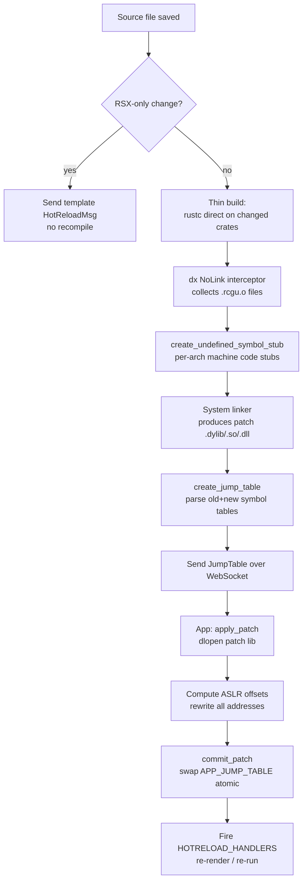

# Subsecond: Architecture Overview

Subsecond is a **jump-table-based hot-patching system** for Rust. When a source file changes, it compiles only the modified code into a fresh shared library, builds a map of old→new function addresses, and swaps that map at runtime. Existing call sites dispatch through the map transparently — no executable memory is ever overwritten.

## Crate Structure

```
packages/subsecond/
├── subsecond/           # Runtime library (user-facing API)
├── subsecond-types/     # Shared wire types (JumpTable, AddressMap)
└── subsecond-tests/     # End-to-end test harnesses

packages/cli/src/
├── build/patch.rs       # Symbol analysis, stub codegen, jump table creation
├── build/request.rs     # Build modes (Fat/Thin), write_patch(), create_jump_table()
├── build/builder.rs     # AppBuilder: patch_rebuild(), ASLR reference storage
├── serve/runner.rs      # Filesystem watcher, file-change dispatch
├── serve/server.rs      # WebSocket server, send_hotpatch()
├── cli/link.rs          # dx-as-linker (NoLink mode)
└── rustcwrapper.rs      # Captures rustc invocations during Fat builds

packages/devtools/src/lib.rs          # App-side: connect, apply_patch()
packages/devtools-types/src/lib.rs    # HotReloadMsg protocol type
```

## End-to-End Pipeline



## Key Design Decision: Jump Tables, Not Memory Patching

Unlike detour/trampoline libraries (which overwrite the first bytes of a function with a `jmp` instruction), subsecond never writes to executable memory pages. Instead:

- Every `subsecond::call(|| { ... })` closure is a **Rust call site** that checks a global `AtomicPtr<JumpTable>` before dispatching.
- The jump table maps old compile-time function addresses to new ones in the freshly loaded patch library.
- In release builds (`!cfg(debug_assertions)`), the check is compiled away entirely — zero overhead in production.

This means:
- No `mprotect`/`VirtualProtect` calls needed.
- No architecture-specific instruction patching.
- The patch boundary is explicit: only code wrapped in `subsecond::call` is hot-reloaded.

## ASLR

The OS loads binaries at randomized base addresses. The jump table stores compile-time addresses; a sentinel symbol (`__SUBSECOND_ASLR_REFERENCE`) is used to compute the slide at runtime and relocate all entries. See [03-aslr.md](03-aslr.md).

## Platform Support

| Platform | Binary patches | cdylib patches |
|----------|---------------|----------------|
| Linux x86_64 | ✅ | ✅ |
| macOS x86_64 / aarch64 | ✅ | ✅ |
| Windows x86_64 | ✅ | ✅ |
| Android arm64 | ✅ | ✅ |
| iOS arm64 (simulator) | ✅ | ✅ |
| WebAssembly (wasm32) | ✅ | ✅ |

See [08-platform-support.md](08-platform-support.md) for known limitations per platform.
