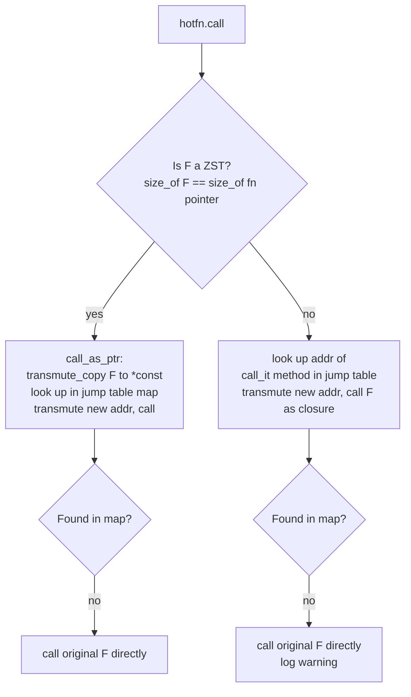

# The Jump Table: Runtime Dispatch

The jump table is the core data structure that makes hot-patching possible at runtime. It maps old function addresses (from the original binary) to new ones (from the patch shared library).

## Wire Types

Defined in [`packages/subsecond/subsecond-types/src/lib.rs`](../../subsecond-types/src/lib.rs):

```rust
pub struct JumpTable {
    pub lib: PathBuf,          // path to the patch .dylib/.so/.dll/.wasm
    pub map: AddressMap,       // HashMap<u64, u64>: old_addr -> new_addr
    pub aslr_reference: u64,   // compile-time address of ASLR sentinel in original binary
    pub new_base_address: u64, // compile-time address of ASLR sentinel in patch
    pub ifunc_count: u64,      // wasm-only: ifunc table slots to allocate
}

pub type AddressMap = HashMap<u64, u64, AddressHasher>;
```

`AddressHasher` is a zero-cost identity hasher — function addresses are already unique integers, so no real hashing is needed.

## Global State

[`packages/subsecond/subsecond/src/lib.rs`](../../subsecond/src/lib.rs) stores the active table as a leaked `Box` behind an atomic pointer:

```rust
static APP_JUMP_TABLE: AtomicPtr<JumpTable> = AtomicPtr::new(std::ptr::null_mut());
static HOTRELOAD_HANDLERS: Mutex<Vec<Arc<dyn Fn()>>> = ...;
```

The pointer is read with `Relaxed` ordering on every hot call — minimal overhead, safe because the table is written once atomically and never mutated in place.

## The `call()` Entry Point

```rust
pub fn call<F: FnMut() + 'static>(mut f: F) -> F {
    if !cfg!(debug_assertions) { return f; }  // zero-overhead in release
    loop {
        let mut hotfn = HotFn::current(&mut f);
        match hotfn.call(()) {
            Ok(_) => return f,
            Err(HotFnPanic) => continue,  // stale inner call unwound; retry
        }
    }
}
```

The `HotFnPanic` retry loop handles the case where a call into the old version of a function panics after a patch is applied mid-execution. The outermost `call` boundary catches it and re-dispatches to the new version.

## Dispatch Path: `HotFn::try_call()`

Two dispatch paths exist depending on whether `F` is a zero-sized type (ZST):



**ZST path (`call_as_ptr`)** — used for plain function pointers:
- `transmute_copy(&f)` extracts the function pointer value as a `u64`
- On Android, strips the MTE pointer tag from the top byte before lookup
- If found in `APP_JUMP_TABLE.map`, transmutes the new address to the correct `fn(...)` type and calls it

**Closure path** — used for closures with captured state:
- Looks up `<F as HotFunction<A, M>>::call_it` as the stable dispatch key
- `call_it` is a method generated by `impl_hot_function!` that exists at a known compile-time address

## The `HotFunction` Trait and Macro

The `impl_hot_function!` macro in [`subsecond/src/lib.rs`](../../subsecond/src/lib.rs) generates `HotFunction` impls for arities 0 through 9:

```rust
// Conceptually what the macro expands to for a 1-arg function:
impl<F, A0, R> HotFunction<(A0,), Fn1Marker> for F
where F: FnMut(A0) -> R
{
    type Real = fn(A0) -> R;
    fn call_it(&mut self, args: (A0,)) -> R { (self)(args.0) }
}
```

`call_it` is the stable vtable entry: its compile-time address is used as the jump table key for closures. This is what makes closure hot-patching possible without any proc-macro on the user's function — the trait impl provides the stable entry point.

**Limitation:** Only `FnMut` with 0–9 arguments is supported. `FnOnce` is not supported.

## Release Build Short-Circuit

Both `call()` and `try_call()` begin with:

```rust
if !cfg!(debug_assertions) {
    return f();
}
```

In release builds the entire jump table mechanism is compiled away. There is no runtime cost, no global state, and no dependency on the table being populated.
