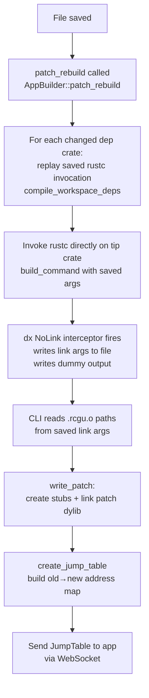

# Build Pipeline: Fat Builds, Thin Builds, and Linker Interception

Subsecond's hot-reload requires two distinct build modes. The first (`Fat`) produces a reference binary with all symbols preserved. Subsequent patches (`Thin`) recompile only the changed crates and link a minimal shared library against the running binary's symbols.

## Build Modes

Defined in [`packages/cli/src/build/request.rs`](../../../cli/src/build/request.rs):

```rust
pub enum BuildMode {
    Base,   // normal cargo build (production)
    Fat {
        // initial hot-reload build
    },
    Thin {
        aslr_reference: u64,
        workspace_rustc_args: HashMap<String, RustcArgs>,
        cache: Arc<HotpatchModuleCache>,
        object_cache: ObjectCache,
        // ...
    },
}
```

## Fat Build

The Fat build is the initial full compilation that produces the patchable binary.

**Key flags added by the CLI:**

| Flag | Platform | Purpose |
|------|----------|---------|
| `-Wl,-all_load` | macOS | Keep all symbols (no dead stripping) |
| `--whole-archive` | Linux | Same |
| `/WHOLEARCHIVE` | Windows | Same |
| `-C debuginfo=2` | All | Force full debug symbols |
| `-C link-dead-code` | All | Keep unreferenced code |

Every symbol from every crate must survive into the final binary. This is what allows the patch to call back into the original binary without a full re-link.

During the Fat build, `dx` is set as `RUSTC_WORKSPACE_WRAPPER`, so it intercepts every `rustc` invocation in the workspace.

## The rustc Wrapper

[`packages/cli/src/rustcwrapper.rs`](../../../cli/src/rustcwrapper.rs) — activated by `RUSTC_WORKSPACE_WRAPPER=dx`.

For each crate compiled during the Fat build, the wrapper serializes the complete rustc invocation to a JSON file:

```
{DX_RUSTC_DIR}/{crate_name}.{bin|lib|cdylib}.json
```

Each JSON file contains:
- All rustc args (source path, edition, crate type, codegen flags, etc.)
- All environment variables at the time of invocation
- All linker args (`-L`, `-l`, `.rlib` paths, etc.)

These saved invocations become `workspace_rustc_args` in the `Thin` build mode and are replayed exactly to recompile individual crates.

## The `dx`-as-Linker (NoLink Mode)

During a Thin build, `dx` substitutes itself as the linker via `RUSTC_FLAGS=-C linker=dx`. When invoked as a linker, it checks the `DX_LINK` environment variable.

[`packages/cli/src/cli/link.rs`](../../../cli/src/cli/link.rs):

```
DX_LINK=NoLink  →  Write all linker args to DX_LINK_ARGS_FILE
                   Write a dummy empty object file as the "output"
                   Return success to rustc

DX_LINK=Base    →  Proxy to the real system linker (used on Android)
```

The dummy output object satisfies rustc/llvm-objcopy post-processing steps that expect an output file to exist. The actual linking is deferred — the CLI host process reads the saved linker args to know which `.rcgu.o` incremental object files were produced, then runs the real linker itself in `write_patch()`.

## Thin Build Flow



## Symbol Cache (`HotpatchModuleCache`)

Parsed once from the Fat binary and reused for every Thin build. Without the cache, the CLI would re-parse a potentially hundreds-of-MB binary on every patch — measured as dropping patch time from ~3s to ~1.1s on the Dioxus docsite.

Defined in [`packages/cli/src/build/patch.rs`](../../../cli/src/build/patch.rs):

```rust
pub struct HotpatchModuleCache {
    pub symbol_table: HashMap<String, CachedSymbol>, // all symbols: name → addr/kind/size
    pub tls_init_data: Vec<u8>,                      // .tdata contents for TLS stubs
    pub tls_init_sizes: HashMap<String, (usize, usize)>, // macOS: TLS symbol offset+size
    // wasm-specific fields omitted
}
```

The cache is populated after the Fat build completes by parsing the output binary with the `object` crate (ELF/Mach-O) or `pdb` crate (Windows PDB).
