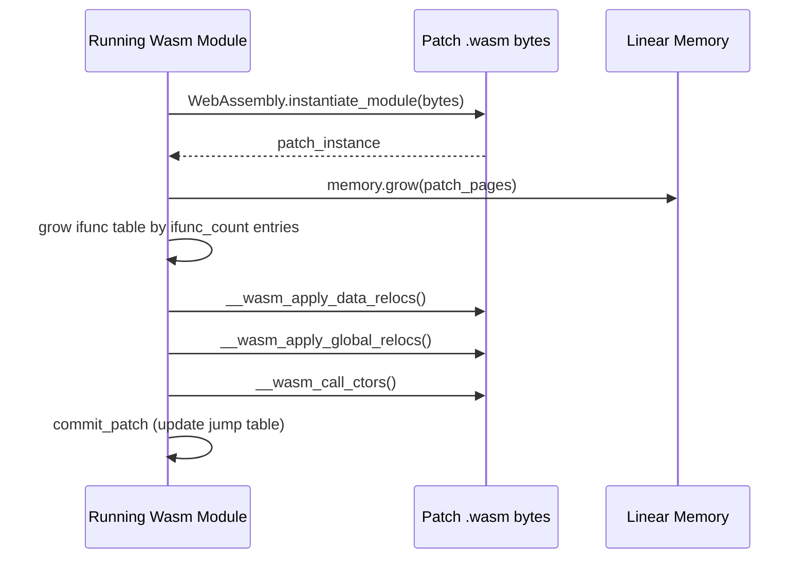

# Runtime Patch Application

`apply_patch()` in [`packages/subsecond/subsecond/src/lib.rs`](../../subsecond/src/lib.rs) takes a `JumpTable` received over the WebSocket and makes it live in the running process.

## Native Platforms (Linux, macOS, Windows)

```rust
pub unsafe fn apply_patch(mut table: JumpTable) -> Result<(), PatchError> {
    // 1. Load the patch shared library
    let lib = libloading::Library::new(&table.lib)?;
    std::mem::forget(lib); // intentionally leak — see below

    // 2. Compute ASLR slides
    let old_offset = aslr_reference() as i64 - table.aslr_reference as i64;
    let new_sentinel = /* dlsym into the newly loaded patch lib */;
    let new_offset = new_sentinel as i64 - table.new_base_address as i64;

    // 3. Relocate all addresses
    for (k, v) in table.map.iter_mut() {
        *k = (*k as i64 + old_offset) as u64;
        *v = (*v as i64 + new_offset) as u64;
    }

    // 4. Commit and notify
    commit_patch(table);
    Ok(())
}
```

### Why the Library is Leaked

`libloading::Library` calls `dlclose`/`FreeLibrary` on drop. Dropping a patch library while functions from it are still on the call stack (or while static destructors reference it) causes a crash. Leaking the handle keeps the library's text segment mapped permanently for the life of the process. This is intentional: each patch accumulates a small amount of resident memory, acceptable given that patching only occurs during development.

### `commit_patch()`

Boxes the `JumpTable`, leaks the Box to get a stable pointer, and swaps it into `APP_JUMP_TABLE` atomically:

```rust
fn commit_patch(table: JumpTable) {
    let ptr = Box::into_raw(Box::new(table));
    APP_JUMP_TABLE.store(ptr, Ordering::Relaxed);
    for handler in HOTRELOAD_HANDLERS.lock().iter() {
        handler();
    }
}
```

The previous `JumpTable` pointer is overwritten without dropping — another intentional leak, since held references to the old table (on other threads mid-dispatch) must remain valid.

## Android: memfd Trick

Standard `dlopen` on Android requires the `.so` file to be on the filesystem at a path accessible to the process. App data directories (`/data/data/<pkg>/`) are not world-writable, and temporary directories may be mounted `noexec`.

Subsecond uses `android_dlopen_ext` with `ANDROID_DLEXT_USE_LIBRARY_FD`:

```rust
let fd = memfd_create(b"subsecond_patch\0", MFD_CLOEXEC)?;
write(fd, &patch_bytes)?;
android_dlopen_ext(
    ptr::null(),       // filename ignored when fd is set
    RTLD_NOW,
    &AndroidDlextInfo {
        flags: ANDROID_DLEXT_USE_LIBRARY_FD,
        library_fd: fd,
        ..Default::default()
    }
)?;
```

The patch library bytes are written to an anonymous in-memory file descriptor (`memfd`), then loaded directly from that fd. No filesystem write is needed.

## WebAssembly

Wasm patches follow a fundamentally different flow because WebAssembly has no `dlopen`. Instead the patch module is fetched and instantiated as a new Wasm module, then its functions are grafted into the running module's indirect function table.



Key steps:
1. **`memory.grow`** — allocates new linear memory pages for the patch module's data segments
2. **Ifunc table growth** — expands the Wasm indirect function table by `table.ifunc_count` entries so the patch's functions can be registered
3. **`__wasm_apply_data_relocs`** — LLVM-generated function that copies initialized data into the newly allocated memory region
4. **`__wasm_apply_global_relocs`** — fixes up global variable references
5. **`__wasm_call_ctors`** — runs static initializers for the patch module

After these steps, the patch's functions are callable via the ifunc table entries, and the jump table map is rewritten to point old ifunc indices to new ones.

### Wasm Limitation: No Unwinding

WebAssembly (at least in the MVP and widely supported feature set) does not support Rust's panic unwinding. The `HotFnPanic` retry mechanism in `call()` is therefore disabled on `wasm32` — framework authors must manually drop any futures or state that reference functions being replaced.

## `HotFnPanic` and the Retry Loop

On native platforms, when a patch arrives while a `subsecond::call` closure is mid-execution, the inner call may be dispatched to the *old* version of a function (read from the previous jump table). After `commit_patch` swaps the table, the old version may panic because the caller's state no longer matches what the new version expects.

`call()` wraps the dispatch in `std::panic::catch_unwind`. A panic from a stale `HotFn` is caught and re-classified as `HotFnPanic`, which causes the outermost `call` boundary to loop and re-dispatch to the new version. This allows graceful recovery from mid-patch panics without propagating them to the user.
