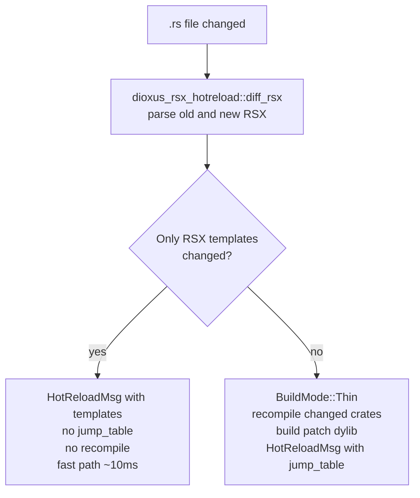
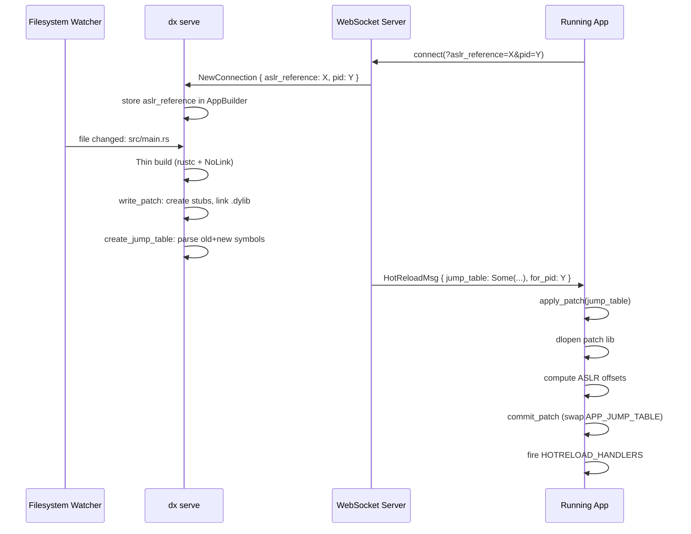

# Delivery Protocol: WebSocket and HotReloadMsg

The CLI's devserver communicates with the running app over a WebSocket connection. Both RSX template changes (no recompile) and binary patches (full Thin build) are delivered through the same channel.

## `HotReloadMsg`

Defined in [`packages/devtools-types/src/lib.rs`](../../../devtools-types/src/lib.rs):

```rust
pub struct HotReloadMsg {
    pub templates: Vec<HotReloadTemplateWithLocation>, // RSX template diffs
    pub assets: Vec<PathBuf>,                          // changed asset files
    pub jump_table: Option<JumpTable>,                 // binary patch (None = template-only)
    pub for_build_id: Option<u64>,                     // targets a specific build
    pub for_pid: Option<u32>,                          // targets a specific process
}
```

`for_pid` is critical: when the app restarts, a new process connects with a new PID. The CLI uses this field to ensure patches built for the previous process are not applied to a new one (different memory layout, different ASLR slide).

## App-Side Connection

[`packages/devtools/src/lib.rs`](../../../devtools/src/lib.rs) provides two connection entry points:

**`connect_subsecond()`** — minimal integration for non-Dioxus projects:
```rust
pub fn connect_subsecond() {
    connect_at(devserver_addr(), |msg| {
        if let Some(jt) = msg.jump_table {
            unsafe { subsecond::apply_patch(jt) }.ok();
        }
    });
}
```

**`connect()`** — Dioxus-specific integration (also calls `dom.runtime().force_all_dirty()` to trigger a full re-render after each patch).

Both call `connect_at()` internally, which spawns a background thread with a WebSocket client.

## Connection URL and ASLR Bootstrap

The connection URL encodes the app's current runtime state so the CLI can build the next patch correctly:

```
ws://localhost:8080/hot-reload?aslr_reference=<u64>&build_id=<u64>&pid=<u32>
```

- **`aslr_reference`** — the runtime address of `__SUBSECOND_ASLR_REFERENCE` (or `main`) in the running process. The CLI stores this and uses it to compute stub addresses for the next patch.
- **`build_id`** — identifies which Fat build this process was launched from. Ensures patches are only sent to matching builds.
- **`pid`** — the process ID. Used to populate `for_pid` on outgoing patches.

The CLI's `AppServer` stores the received `aslr_reference` in `AppBuilder` when processing `ServeUpdate::NewConnection { aslr_reference, id, pid }` in [`packages/cli/src/serve/runner.rs`](../../../cli/src/serve/runner.rs).

## RSX-Only vs. Code-Change Hot Reload

Not all file changes require recompilation. The CLI distinguishes two cases:



RSX-only changes cover edits to `.rsx!{}` macro content (element structure, text, attributes) that don't alter Rust logic. These are diffed at the AST level and applied by the Dioxus renderer directly, without loading any new code.

Code changes (any Rust logic outside RSX macros) require the full Thin build pipeline and a binary patch.

## Patch Delivery Sequence



## Server-Side Dispatch

[`packages/cli/src/serve/server.rs`](../../../cli/src/serve/server.rs) manages WebSocket connections. `send_hotpatch()` serializes the `HotReloadMsg` with `serde_json` and broadcasts it to all connected clients matching the current `build_id`.

The server tracks each client's `aslr_reference` separately, since multiple processes (e.g., multiple simulator instances) may be connected simultaneously with different ASLR slides.
